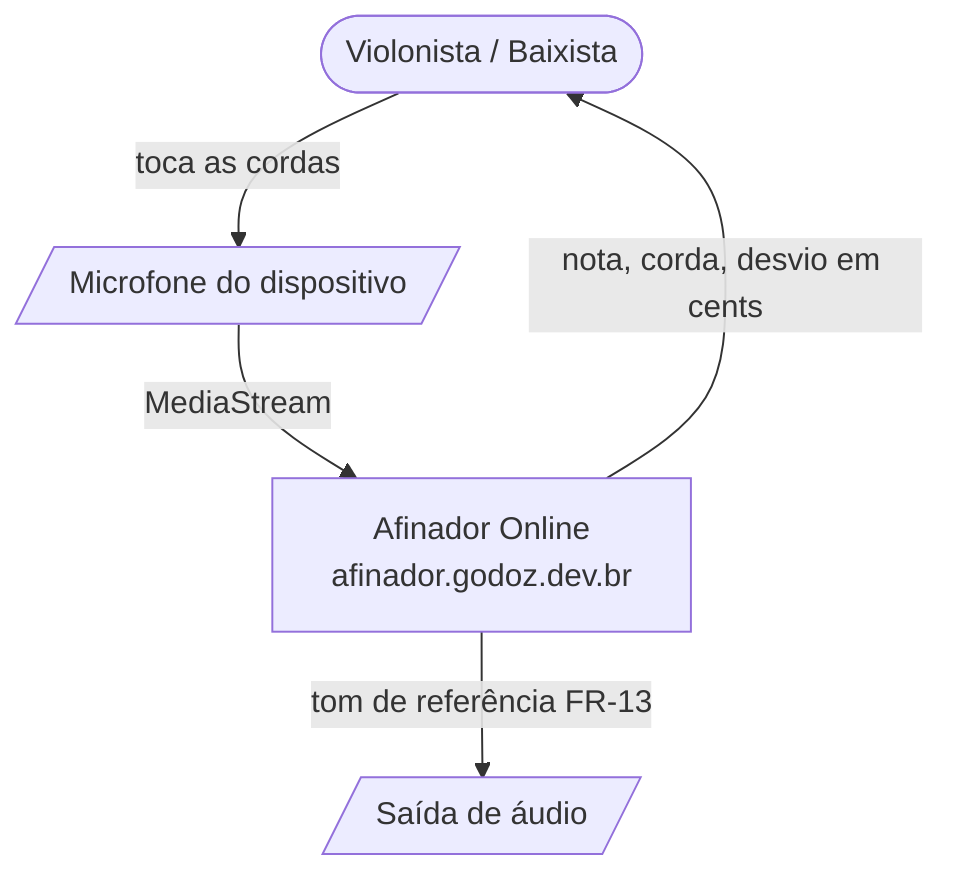
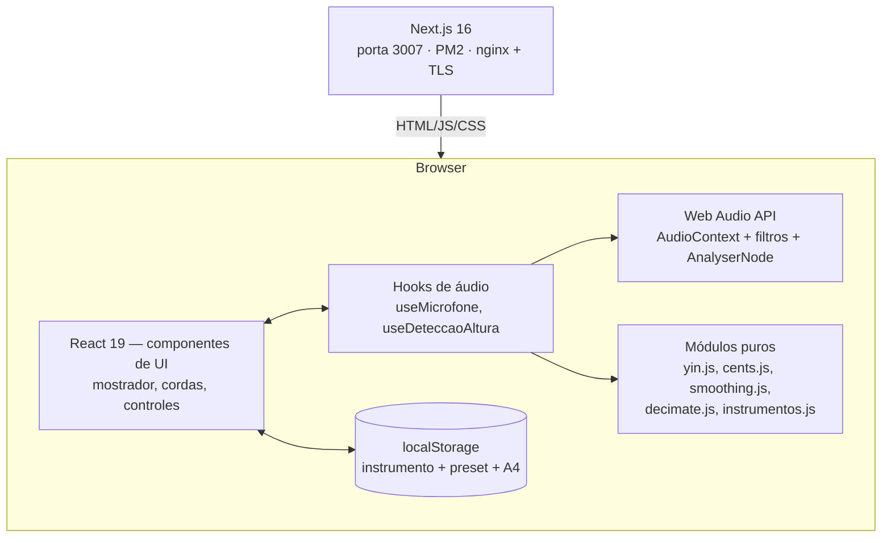
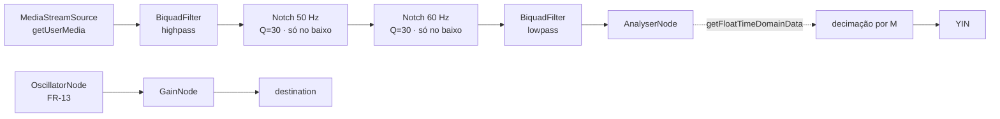
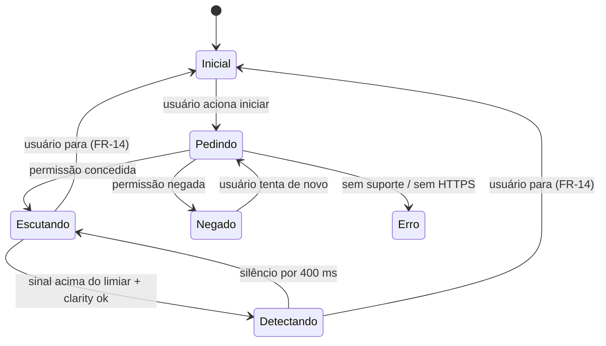

# Design: Afinador Online — Violão e Baixo

## 0. Abordagem de design visual (NFR-7)

O reuso do padrão dos outros repositórios (Luccare, Bandapp, Agiotapp) é **escopado à stack e à
organização do código** — Next.js App Router, `src/components`, `src/lib`, Tailwind v4, JS puro.
O resultado visual não é herdado: aqui a tela é essencialmente um instrumento, e o mostrador
manda na composição. Implementar a tela do afinador primeiro, revisar no navegador, e só depois
propagar tipografia/cores para os controles secundários.

## 1. Context Diagram (C4 Level 1)



Sem sistemas externos: nenhuma chamada de rede depois do carregamento da página (NFR-4).

## 2. Container Diagram (C4 Level 2)



Container único. Não há backend: o Next.js serve apenas os assets. A separação que importa é
entre **módulos puros** (`src/lib`, sem `window`, testáveis em Node) e **hooks** (efeitos
colaterais de áudio). Ver §7.

## 3. Grafo de áudio e perfis por instrumento



O afinador não tem **um** conjunto de parâmetros: tem um **perfil por instrumento** (FR-0),
porque a corda mais grave de cada um está a mais de uma oitava de distância da outra
(E2 = 82,41 Hz no violão, B0 = 30,87 Hz no baixo de 5).

| Parâmetro | Violão/guitarra | Baixo | Por quê |
|---|---|---|---|
| Faixa de busca (FR-3) | 65–700 Hz | 28–450 Hz | Cobre a corda mais grave do instrumento com margem de um tom abaixo, e as fundamentais mais agudas com casas presas. |
| `fftSize` (janela) | 4096 (85 ms @48 kHz) | **8192** (171 ms) | YIN precisa de ≥ 2 períodos; na prática ≥ 5 para um vale confiável. 4096 dá 6,3 períodos do D2, mas só **2,6** do B0 — insuficiente. 8192 dá 5,3 períodos do B0 e 7,0 do E1. |
| Highpass | 60 Hz | **25 Hz** | No violão corta zumbido de rede abaixo do D2 (73,42 Hz). No baixo isso é impossível: E1 = 41,20 Hz e A1 = 55,00 Hz estão *abaixo* do zumbido de 60 Hz. Daí os notches. |
| Notch 50 e 60 Hz | não | **sim**, Q = 30 | Único jeito de atacar zumbido de rede sem comer a corda A1. Ver análise abaixo. |
| Lowpass | 1000 Hz | 500 Hz | Atenua harmônicos e sibilância acima da faixa de fundamentais de interesse. |
| Decimação M | 2 → 24 kHz | 4 → 12 kHz | §4 — obrigatória, não é otimização opcional. |
| Latência-alvo (NFR-2) | ≤ 150 ms | ≤ 250 ms | Consequência direta da janela. |

**Por que notch e não highpass, no baixo.** O zumbido de rede (50 Hz na Europa, 60 Hz no Brasil e
EUA) cai bem no meio da tessitura do baixo: 60 Hz fica entre A1 (55,00 Hz) e D2 (73,42 Hz). Um
highpass em 65 Hz mataria as duas cordas mais graves junto com o zumbido. Um notch com Q = 30 em
60 Hz tem largura de banda de 2 Hz — a 55 Hz (A1) a atenuação é desprezível, e a distância em
cents entre 55 e 60 Hz é de 151 cents, um semitom e meio. Ou seja: dá para remover a interferência
sem tocar na nota. Os dois notches (50 e 60) ficam sempre ligados no perfil de baixo, porque não
há como saber a rede elétrica do usuário e o custo de um biquad é irrisório.

**Flags de captura.** `echoCancellation`, `noiseSuppression` e `autoGainControl` em `false`
(FR-1) nos dois perfis — ver `decisions.md` D8.

`AnalyserNode.getFloatTimeDomainData` é preferido a `ScriptProcessorNode` (obsoleto) e a um
`AudioWorklet` (`decisions.md` D3).

## 4. Detecção de altura — YIN sobre sinal decimado

Métodos baseados em FFT não servem: com janela de 4096 a 48 kHz a resolução espectral é 11,7 Hz,
enquanto 1 cent no E2 vale 0,048 Hz e no B0 apenas 0,018 Hz (NFR-1). Detecção no domínio do tempo
por autocorrelação resolve — o período é medido em amostras e refinado por interpolação.

### 4.1 Decimação (obrigatória)

O custo do YIN é `(τmax − τmin) × N`. Sem decimar, o perfil de baixo custaria **13,2 M operações
por frame** (τmax = 1714 amostras a 48 kHz) — cinco vezes o violão, num laço a 30 Hz. Inviável em
celular.

A saída é decimar antes de analisar. O lowpass do grafo já limita a banda (1 kHz no violão,
500 Hz no baixo), então reduzir a taxa é seguro por Nyquist com folga larga:

| Perfil | Taxa após decimação | Nyquist | Lowpass | N efetivo | τ | Custo/frame |
|---|---|---|---|---|---|---|
| Violão (M = 2) | 24 kHz | 12 kHz | 1 kHz | 2048 | 34–369 | **0,69 M** |
| Baixo (M = 4) | 12 kHz | 6 kHz | 500 Hz | 2048 | 27–429 | **0,82 M** |

Os dois perfis caem para menos de 1 M de operações por frame — abaixo do custo do violão sem
decimação (2,74 M). A decimação deixa de ser plano B e vira parte do desenho (`decisions.md` D11).

Resolução não se perde: a precisão vem da **interpolação parabólica**, não da taxa de amostragem.
A 12 kHz, um período do B0 tem 389 amostras — degraus de τ inteiro valem ~4,5 cents, que a
interpolação reduz a bem menos de 1 cent.

### 4.2 Algoritmo

`src/lib/pitch/yin.js`, função pura `criarDetector({ tamanho, sampleRate, fmin, fmax })` que
devolve `detectar(buffer) -> { frequencia, clarity } | null`:

1. **Função diferença** `d(τ) = Σ (x[i] − x[i+τ])²` para τ em `[sr/fmax, sr/fmin]`. Restringir τ
   à faixa do instrumento elimina a maior parte dos erros de oitava e corta o custo do laço.
2. **Normalização cumulativa média** `d'(τ) = d(τ) / [(1/τ) Σ d(j)]`, com `d'(0) = 1`. É esse
   passo que derruba o erro de oitava clássico da autocorrelação pura (o pico em 2τ) — o problema
   dominante na corda mais grave, e mais grave ainda no baixo, cujo timbre tem fundamental fraca
   e 2ª parcial forte.
3. **Limiar absoluto:** primeiro τ com `d'(τ) < 0,15`; percorre-se o vale local até o mínimo, em
   vez de aceitar o primeiro cruzamento. Se nenhum τ passa, retorna `null` (alimenta FR-4).
4. **Interpolação parabólica** com `d'(τ−1), d'(τ), d'(τ+1)` para τ sub-amostral.
5. `frequencia = sampleRate / τ_refinado`; `clarity = 1 − d'(τ)` como confiança.

**Porta de silêncio (FR-4):** RMS do buffer calculado antes do YIN; abaixo de −50 dBFS o frame é
descartado sem rodar o algoritmo.

## 5. Suavização e histerese (NFR-2)

Estimativas cruas a 30 Hz tremem. Pipeline em `src/lib/pitch/smoothing.js`:

1. **Mediana móvel de 5** sobre as frequências recentes — mata *outliers* isolados (um frame com
   erro de oitava não move o ponteiro).
2. **Suavização exponencial** sobre o valor em **cents**, não em Hz (α ≈ 0,25). Suavizar em Hz
   daria resposta desigual entre grave e agudo — e com baixo no jogo a faixa vai de 30 Hz a
   330 Hz, uma década inteira.
3. **Retenção:** ao perder o sinal, a última leitura válida permanece por 400 ms antes de voltar
   a "aguardando" (FR-4).
4. **Confirmação de afinado:** 700 ms contínuos com |cents| ≤ 5 (FR-8). Sair da faixa reinicia o
   temporizador; a corda só perde o selo se ultrapassar ±10 cents — banda morta contra piscar.

## 6. Modelo de instrumentos e afinações

`src/lib/instrumentos.js` — dados, sem lógica de UI:

- Cordas definidas por **número MIDI**, nunca por Hz literal.
  `freq(midi, a4) = a4 · 2^((midi−69)/12)` torna FR-12 trivial e elimina constante mal digitada.
- Cada instrumento carrega seu **perfil de análise** (§3) junto com seus presets.
- Cada preset declara a grafia preferida (`sustenido` | `bemol`): baixista lê "Eb / Ab / Db", não
  "D# / G# / C#". A nota cromática do FR-6, fora do contexto de preset, usa sustenidos.

**Violão/guitarra — 6 cordas** (A4 = 440 Hz):

| Preset | 6 | 5 | 4 | 3 | 2 | 1 |
|---|---|---|---|---|---|---|
| Padrão (E) | E2 82,41 | A2 110,00 | D3 146,83 | G3 196,00 | B3 246,94 | E4 329,63 |
| Drop D | D2 73,42 | A2 110,00 | D3 146,83 | G3 196,00 | B3 246,94 | E4 329,63 |
| Meio tom abaixo (Eb) | Eb2 77,78 | Ab2 103,83 | Db3 138,59 | Gb3 185,00 | Bb3 233,08 | Eb4 311,13 |
| Um tom abaixo (D) | D2 73,42 | G2 98,00 | C3 130,81 | F3 174,61 | A3 220,00 | D4 293,66 |
| DADGAD | D2 73,42 | A2 110,00 | D3 146,83 | G3 196,00 | A3 220,00 | D4 293,66 |
| Open G | D2 73,42 | G2 98,00 | D3 146,83 | G3 196,00 | B3 246,94 | D4 293,66 |

**Baixo — 4 cordas:**

| Preset | 4 | 3 | 2 | 1 |
|---|---|---|---|---|
| Padrão (E) | E1 41,20 | A1 55,00 | D2 73,42 | G2 98,00 |
| Drop D | D1 36,71 | A1 55,00 | D2 73,42 | G2 98,00 |
| Meio tom abaixo (Eb) | Eb1 38,89 | Ab1 51,91 | Db2 69,30 | Gb2 92,50 |

**Baixo — 5 cordas:**

| Preset | 5 | 4 | 3 | 2 | 1 |
|---|---|---|---|---|---|
| Padrão (B) | B0 30,87 | E1 41,20 | A1 55,00 | D2 73,42 | G2 98,00 |

- `src/lib/pitch/cents.js`: `cents(f, alvo) = 1200 · log₂(f/alvo)`; `cordaMaisProxima(f, cordas)`
  devolve a corda de menor |cents| e o valor; acima de 100 cents o chamador trata como FR-6.
  `notaCromatica(f, a4)` devolve nome e desvio para o mesmo caso.

**Cordas repetidas:** DADGAD tem D2/D3/D4 e A2/A3; o baixo de 5 e o violão compartilham D2, G2 e
A1/A2 em oitavas diferentes. A comparação é sempre por frequência absoluta em cents, então
oitavas distintas nunca colidem; o que colide é a *rotulagem* na UI, resolvida exibindo a oitava
e o número da corda.

## 7. Estrutura de arquivos

```
Afinador/
├── CLAUDE.md
├── README.md
├── specs/2026-08-03-afinador-violao/
└── frontend/
    ├── package.json          next dev -p 3007 · next start -p 3007
    ├── jsconfig.json         alias @/ → src/
    └── src/
        ├── app/
        │   ├── layout.js     metadata pt-BR, <html lang="pt-BR">
        │   ├── globals.css   Tailwind v4 + tokens do mostrador
        │   └── page.js       'use client' — monta <Afinador />
        ├── components/
        │   ├── afinador/
        │   │   ├── Afinador.js            orquestrador: estado, hooks, composição
        │   │   ├── Mostrador.js           SVG: arco, ponteiro, cents, nota
        │   │   ├── ListaCordas.js         4/5/6 cordas: pendente | ativa | afinada
        │   │   ├── SeletorInstrumento.js  violão | baixo 4 | baixo 5 (FR-0)
        │   │   ├── SeletorAfinacao.js     presets do instrumento atual (FR-11)
        │   │   ├── AjusteDiapasao.js      A4 415–466 (FR-12)
        │   │   └── PermissaoMicrofone.js  inicial | pedindo | negado | erro (FR-1, FR-2)
        │   └── ui/
        │       └── Botao.js
        ├── hooks/
        │   ├── useMicrofone.js         getUserMedia, grafo por perfil, cleanup (FR-0, FR-1, FR-14)
        │   ├── useDeteccaoAltura.js    laço rAF + decimação + YIN + suavização
        │   └── useTomReferencia.js     oscilador, com oitava acima abaixo de 60 Hz (FR-13)
        └── lib/
            ├── instrumentos.js         instrumentos, perfis de análise e presets
            └── pitch/
                ├── yin.js
                ├── decimate.js
                ├── cents.js
                └── smoothing.js
```

Regra de ouro: **nada em `src/lib` toca `window`, `AudioContext` ou React.** É o que permite
testar o algoritmo com tons sintéticos em Node (Task 2 e 9) sem navegador.

## 8. Estado e fluxo de dados



Estado de UI no `Afinador.js`: `{ instrumentoId, afinacaoId, a4, cordaTravada,
cordasAfinadas: Set, leitura }`. `leitura` é o objeto emitido pelo `useDeteccaoAltura`:
`{ frequencia, clarity, cents, cordaId, notaCromatica, foraDaAfinacao }`.

**Troca de instrumento** (FR-0) reconstrói o grafo de áudio (filtros e `fftSize` diferem) e
recria o detector YIN. Isso não exige pedir permissão de novo — o `MediaStream` é preservado e só
os nós de processamento são refeitos.

A 30 Hz, `setState` a cada frame re-renderiza a árvore inteira 30×/s. Mitigação: o `Mostrador`
recebe os valores contínuos e é `React.memo`; ponteiro e número de cents são atualizados via
`ref` no SVG dentro do próprio laço, e `setState` só dispara em **mudanças discretas** (troca de
corda ativa, entrou/saiu de afinado, ganhou/perdeu sinal). Ver `decisions.md` D6.

## 9. Interface

Tela única, mobile-first, `max-w-[520px] mx-auto`, sem rolagem para operar (FR-15):

1. **Mostrador (topo, dominante):** arco de −50 a +50 cents com zona verde estreita em ±5;
   ponteiro; ao centro o nome da nota-alvo em corpo grande com a oitava; abaixo, o desvio
   numérico e o rótulo **"aperte"** / **"afrouxe"** / **"afinado"** (FR-7). Cor sinaliza estado,
   mas nunca sozinha (NFR-6).
2. **Lista de cordas:** 4, 5 ou 6 pastilhas conforme o instrumento, na ordem da mais grave para a
   mais aguda, com nome e oitava; estados distintos para pendente, ativa e afinada; toque trava a
   corda (FR-10), toque longo emite o tom de referência (FR-13). O layout usa grade fluida — não
   pode assumir seis colunas.
3. **Controles (rodapé):** seletor de instrumento, seletor de afinação, ajuste de A4, botão parar.
4. **Antes de iniciar:** cartão explicando que o áudio não sai do dispositivo (NFR-4) e o botão
   que dispara a permissão — obrigatório ser gesto do usuário por causa do iOS (NFR-5).

`aria-live="polite"` numa região textual que anuncia "Corda 5, A2, 12 cents abaixo, aperte",
atualizada com *throttle* de 1 s (NFR-6).

## 10. Deploy

Segue o padrão de `c:\Git\vps-config` (VPS Hostinger KVM 2, PM2 + nginx):

- **PM2:** app `afinador-web`, `exec_mode: 'fork'`, `instances: 1`, `PORT: 3007`,
  `NEXT_TELEMETRY_DISABLED: '1'`, acrescentado ao `ecosystem.config.js` existente.
- **nginx:** `afinador.godoz.dev.br` → `upstream 127.0.0.1:3007` com `keepalive 32`, seguindo
  `nginx/luccare.conf` como molde. Sem bloco de API e sem `map $connection_upgrade` — não há
  backend nem WebSocket neste projeto.
- **TLS via certbot** (`--nginx -d afinador.godoz.dev.br`): obrigatório, não opcional — sem HTTPS
  o `getUserMedia` não existe e o afinador não funciona (D9).
- `"start": "next start -p 3007"` **com a porta explícita** no `package.json`, evitando a
  armadilha já documentada no `vps-config/README.md` §1 (o Luccare tinha `next start` sem porta e
  caía na 3000, que era a da API).

## 11. Riscos técnicos

| Risco | Impacto | Mitigação |
|---|---|---|
| Erro de oitava nas cordas graves — pior no baixo, cuja fundamental é fraca perto da 2ª parcial | Afinador manda apertar quando devia afrouxar | Normalização cumulativa do YIN (§4.2) + faixa τ limitada por instrumento + mediana móvel + escape do FR-10 |
| Zumbido de rede dentro da tessitura do baixo (60 Hz entre A1 e D2) | Afinador "detecta" a rede elétrica | Notches de 50 e 60 Hz com Q = 30 (§3); cenário 7 de aceitação |
| Microfone de celular não capta 30–40 Hz com nível útil | B0 e E1 ilegíveis em alguns aparelhos | Validar em dispositivos reais (Task 9); YIN trabalha bem sobre a 2ª parcial quando a fundamental é fraca, desde que a faixa τ permita — por isso `fmax` do baixo é 450 Hz, não 120 Hz |
| CPU em celular de entrada | Ponteiro travando | Decimação (§4.1), buffers pré-alocados, throttle a 30 Hz |
| Safari/iOS com `AudioContext` suspenso | Afinador não liga no iPhone | Criar e retomar o contexto no handler de clique; testar em dispositivo real |
| Latência do baixo percebida como "lentidão" | Usuário acha que travou | Feedback visual de "ouvindo" durante a janela; expectativa documentada em NFR-2 |
| Página sem HTTPS em produção | `getUserMedia` indisponível | FR-2 detecta e explica; TLS é pré-requisito de deploy (§10, D9) |
